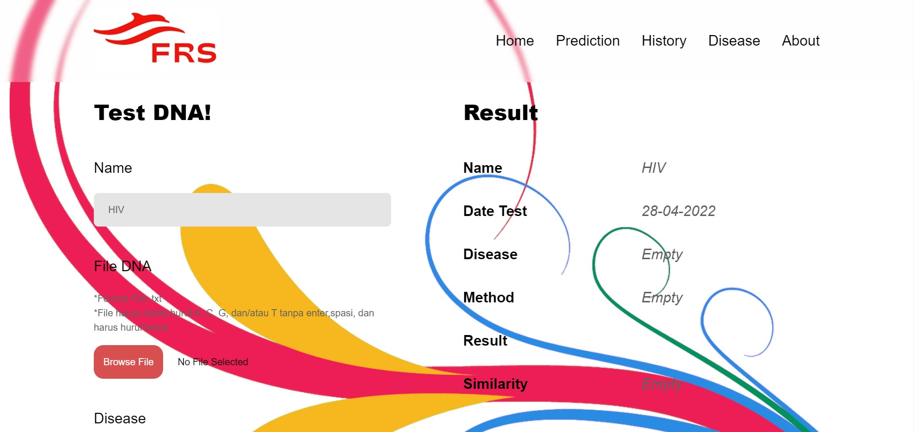

# FRS Part2!

> _This program is created to fullfil an assignment of the course `algorithm strategy (IF2211)`_ <br/>
>
> _Program Studi Teknik Informatika <br/>
> Sekolah Teknik Elektro dan Informatika <br/>
> Institut Teknologi Bandung <br/>
> Semester II Tahun 2021/2022 <br/>_

## Table of Content
* [Description](#Description)
* [Screenshoot](#Screenshoot)
* [Features](#Features)
* [Running the Program](#Running-the-Program)
* [Automated Tests](#Automated-Tests)
* [Project Status](#Project-Status)
* [Authors](#Authors)

## Description
Program ini merupakan sebuah program website dengan pembagian yang jelas antara frontend dan backendnya. 
Website ini dibuat dengan mengaplikasikan React Js pada bagian Frontend serta Algoritma Boyer Moore, Algoritma KMP,
serta Regex pada bagian Backend prosesnya serta Mysql pada bagian databasenya.

## Screenshot


## Features
Berikut adalah fitur-fitur yang diimplementasikan pada website ini:
1. Menambahkan penyakit pada database "jenis penyakit"
2. Melakukan pencarian hasil prediksi berdasarkan tanggal
3. Melakukan pencarian hasil prediksi berdasarkan penyakit prediksi
4. Melakukan pencarian hasil prediksi berdasarkan tanggal dan penyakit prediksi
5. Melakukan tes DNA 
6. Menampilkan persen kemiripan penyakit
## Running the Program
To run the program:
```
npm run dev
```
This Website Also Deploy on:
```
hmif.link/FRSPart2.com
```

## Project Status
> **Project is: _complete_**

## Authors
<table>
    <tr>
      <td><a href="https://github.com/febryola"><b>Febryola Kurnia Putri</b></a></td>
      <td><b>13520140</b></td>
    </tr>
    <tr>
      <td><a href="https://github.com/StevenSiahaann"><b>Steven Gianmarg H. Siahaan</b></a></td>
      <td><b>13520145</b></td>
    </tr>
    <tr>
      <td><a href="https://github.com/Radenz"><b>Raden Rifqi Rahman</b></a></td>
      <td><b>13520166</b></td>
    </tr>
</table>